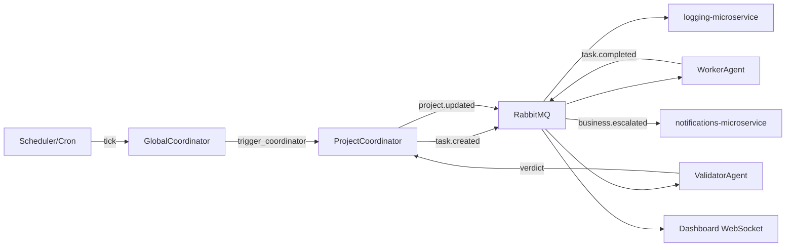

# `business-orchestrator` — Production Architecture Design

**Version**: 1.0.0-spec | **Status**: PRODUCTION | **Date**: 2026-04-29

> See also: [schemas/](schemas/) · [adr/](adr/) · [MVP_VERTICAL_SLICE.md](MVP_VERTICAL_SLICE.md)

---

## 1. SYSTEM OVERVIEW

### What is `business-orchestrator` (Project OS)

A production microservice that is the **operating system for running multiple digital projects** with **agent workers** and **human approvals**. It manages goals, AI-proposed plans, tasks, validation, and project state across many initiatives in parallel.

Humans approve plans and escalations; agents execute under that control plane. It does **not** run LLM inference itself — it **coordinates** coordinators, workers, and validators through **ai-microservice** and MCP tools.

**Production URL**: `https://orchestrator.alfares.cz`
**Docker Network**: `http://business-orchestrator:3390`
**Port range**: 3390 (blue), 3391 (green)
**Technology**: NestJS (TypeScript) — consistent with ecosystem standard

### Responsibilities

| # | Responsibility |
|---|----------------|
| 1 | Manage lifecycle of Business, Project, Agent, Task, Execution entities |
| 2 | Spawn and coordinate GlobalCoordinator, ProjectCoordinators, WorkerAgents, ValidatorAgents |
| 3 | Generate tasks automatically based on project state |
| 4 | Route tasks to appropriate agents based on type and capacity |
| 5 | Track agent health, failures, retries, escalations |
| 6 | Maintain minimal JSON state snapshots per project |
| 7 | Emit domain events (task.created, agent.failed, etc.) |
| 8 | Expose owner dashboard API |
| 9 | Enforce token budget per task/agent/business |

### Boundaries — What It Does NOT Do

| What | Who Does It |
|------|-------------|
| AI model inference | `ai-microservice` |
| Send notifications to owner | `notifications-microservice` |
| Persistent data storage | `database-server` (PostgreSQL) |
| Log execution traces | `logging-microservice` |
| Web scraping / browser automation | Agent via MCP Playwright server |
| File storage for artifacts | `minio-microservice` |
| Authentication of owner dashboard | `auth-microservice` |
| Own product/order/stock domain truth | `catalog`, `orders`, `warehouse`, `leads` |

### Integration Map

```
business-orchestrator
├── CALLS → ai-microservice            (LLM inference, model tier routing)
├── CALLS → logging-microservice       (all events with duration_ms + ISO timestamps)
├── CALLS → notifications-microservice (escalation to human owner only)
├── CALLS → database-server            (PostgreSQL schema + Redis locks)
├── READS → agentic-email-processing-system (inbound email signals → task triggers)
├── READS → orders-microservice        (order events → reactive task creation)
├── READS → auth-microservice          (JWT validation for dashboard)
└── EXPOSES → REST API + WebSocket     (owner dashboard)
```

---

## 2. DOMAIN DESIGN (DDD)

**Bounded context:** `Orchestration`. **Anti-corruption layer:** integration tasks map external IDs only; orchestrator never mirrors full order/product rows.

### Aggregate: `Business`

```text
id             uuid PK
slug           text UNIQUE       e.g. "flipflop", "speakasap"
name           text
owner_id       uuid              reference to auth-microservice user
status         enum              active | suspended | archived
quota          jsonb             max_concurrent_tasks, daily_llm_units
settings_ref   text              pointer to versioned config
created_at     timestamptz
```

**Lifecycle:** `draft → active → suspended → archived`

**Invariants:**

- `slug` unique across system
- `suspended` blocks new non-escalation tasks
- `quota` enforced before task assignment
- Cannot archive if tasks are `in_progress`

---

### Aggregate: `Project`

```text
id                   uuid PK
business_id          uuid FK → businesses
slug                 text UNIQUE within business
name                 text
repo_ref             text              git URL + branch policy
stage                text              discovery | mvp | growth | mature | sunset
status               text              planning | active | paused | completed | cancelled
coordinator_agent_id uuid nullable FK → agents
state_snapshot       jsonb             compact state (see §5, max 8KB)
state_version        int               monotonic, incremented per material change
last_cycle_at        timestamptz
created_at           timestamptz
```

**Lifecycle:** `planning → active ↔ paused → completed | cancelled`

**Invariants:**

- `repo_ref` immutable without explicit owner-approval event
- `paused` drains in-flight tasks before stopping new assignments (configurable policy)
- `state_snapshot` must deserialize to schema vN (see [schemas/state.schema.json](schemas/state.schema.json))

---

### Aggregate: `Agent`

```text
id               uuid PK
type             enum   global_coordinator | project_coordinator | worker | validator
project_id       uuid nullable FK → projects
status           enum   idle | busy | draining | failed | disabled
model_tier       enum   free | cheap | smart
capabilities     jsonb  array of capability codes e.g. ["write", "git", "playwright"]
current_task_id  uuid nullable FK → tasks
memory_ref       text   pointer to latest session-summary artifact
last_heartbeat   timestamptz
failure_count    int    consecutive failures; 3+ → auto-disabled
created_at       timestamptz
```

**Lifecycle:** `registered → idle ↔ busy → draining → disabled`; `failed → auto-retry | human`

**Invariants:**

- `validator` type never assigned as `worker` on same task it validates
- `global_coordinator`: `project_id` always null; max 1 elected leader
- `capabilities` must be a subset allowed for that agent `type`

---

### Aggregate: `Task`

```text
id                uuid PK
project_id        uuid FK → projects
parent_task_id    uuid nullable FK → tasks
type              text             e.g. impl | review | research | integrate_orders
priority          smallint         1 (urgent) to 5 (background)
status            text             created | assigned | in_progress | validation | done | failed | cancelled
payload_ref       jsonb            small spec JSON or artifact ref — NO inline blobs
assignee_agent_id uuid nullable FK → agents
attempt           smallint         current attempt number
max_attempts      smallint         default 3
idempotency_key   text UNIQUE per project
blocked_reason    text nullable
acceptance_criteria  jsonb         array of criterion codes (max 3)
output_ref        jsonb nullable   ref to artifact or DB record
created_at        timestamptz
assigned_at       timestamptz nullable
completed_at      timestamptz nullable
```

**Lifecycle:** See §4

**Invariants:**

- Acyclic parent chain (enforced at creation)
- `idempotency_key` unique per project (prevents duplicate task creation)
- `payload_ref` must be a reference — inline blobs rejected at API level
- `acceptance_criteria` max 3 items (forces atomic granularity)

---

### Aggregate: `Execution`

```
id                    uuid PK
task_id               uuid FK → tasks
agent_id              uuid FK → agents
phase                 enum   run | validate
attempt_number        smallint
started_at            timestamptz
ended_at              timestamptz nullable
outcome               enum   success | fail | timeout
output_ref            jsonb nullable
token_usage_estimate  int
error_code            text nullable
model_used            text              e.g. "gemma2:9b", "gemini-flash"
duration_ms           int
```

**Invariants:**

- One active execution per task per phase (partial unique index)
- Immutable after terminal state (correction = new execution row)
- `duration_ms` and `token_usage_estimate` always recorded (required for cost tracking)

---

### Value Object: `State`

Not a separate aggregate. Lives in `projects.state_snapshot` JSONB. See §5 and [schemas/state.schema.json](schemas/state.schema.json).

---

## 3. AGENT SYSTEM DESIGN

### `GlobalCoordinator` (1 logical, leader-elected)

**Tick interval:** Every 15 minutes (configurable by business tier)

**Responsibilities:**

- Cross-business priority and quota enforcement
- Schedule `ProjectCoordinator` ticks for active projects
- Detect stalled projects (no completions in >24h)
- Route escalations to `notifications-microservice`
- Never executes tasks — only dispatches directives

**Input (per tick):**

```json
{
  "tick": "2026-04-04T10:00:00Z",
  "projects": [
    {"id": "uuid", "slug": "flipflop", "health": "ok", "tasks_active": 3, "stalled_h": 0},
    {"id": "uuid", "slug": "speakasap", "health": "warning", "tasks_active": 0, "stalled_h": 6}
  ],
  "quota_reports": [{"business_id": "uuid", "units_used": 4200, "units_cap": 10000}],
  "agents_failed": [{"id": "uuid", "project": "speakasap", "since": "2026-04-04T04:00:00Z"}]
}
```

**Output (directives):**

```json
{
  "actions": [
    {"type": "trigger_coordinator", "project_id": "uuid"},
    {"type": "escalate_human", "project_id": "uuid", "reason": "stalled_6h"},
    {"type": "suspend_business", "business_id": "uuid", "reason": "quota_exceeded"}
  ]
}
```

**Memory model:** Stateless per tick. Reads all project `state_snapshot` fields fresh each cycle. No LLM call for ticks that produce no directives (deterministic policy-based check first).

**Model tier:** `smart` — called only when ambiguous cross-project prioritization needed (not every tick)

**Failure handling:**

- Leader lease expires → new replica claims leader role
- Stale leader rejects writes via lease token comparison
- 3 consecutive tick failures → `notifications-microservice` alerts owner

---

### `ProjectCoordinator` (1 per active project)

**Tick interval:** 1–60 minutes (adaptive: faster when backlog > 0)

**Responsibilities:**

- Read `SYSTEM.md`, `AGENTS.md`, `STATE.json` via MCP
- Decompose project goals into atomic tasks (one verifiable outcome each)
- Build dependency graph for task ordering
- Assign tasks to available `WorkerAgent` instances
- Request `ValidatorAgent` after each worker completion
- Update `state_snapshot` at end of each cycle

**Input:**

```json
{
  "project_id": "uuid",
  "state": {"v": 3, "project": "flipflop", "stage": "mvp", "health": "ok", "tasks_active": 2, "tasks_queued": 0},
  "available_workers": 3,
  "last_cycle_diff": "2 tasks completed: write_copy, fix_image_link",
  "failed_tasks": []
}
```

**Output:**

```json
{
  "new_tasks": [
    {
      "type": "write_product_description",
      "idempotency_key": "sku-447-desc-v1",
      "payload_ref": {"source": "mcp:postgres", "query": "SELECT * FROM products WHERE sku='SKU-447'"},
      "acceptance_criteria": ["json_valid", "word_count_lte_300", "contains_brand"],
      "priority": 2,
      "max_attempts": 3
    }
  ],
  "state_patch": {"tasks_queued": 1, "next_focus": "product descriptions for 10 SKUs"},
  "decisions": ["Paused SEO audit — no traffic data available yet"]
}
```

**Memory model:**

- Per-cycle: reads `STATE.json` (via MCP) + last 10 task completion summaries from Redis (TTL 1h)
- Rolling summary of open task DAG — IDs + deps only, no content
- Max 3000 tokens total context per cycle

**Model tier:** `cheap` (Ollama llama3.1:8b or equivalent OpenRouter free)

**Failure handling:**

- Failed cycle → log, `GlobalCoordinator` retries next scan
- 3 consecutive failures → `health=critical`, human escalation

---

### `WorkerAgent` (dynamic pool, 0–200 total)

**Execution mode:** Stateless, one-shot per task

**Responsibilities:**

- Execute exactly ONE atomic task
- Use MCP tools for IO (filesystem, git, DB, playwright) — not LLM calls
- Produce structured JSON output matching `acceptance_criteria`
- Report result or structured failure code

**Input:**

```json
{
  "task_id": "uuid",
  "type": "write_product_description",
  "payload_ref": {"source": "mcp:postgres", "query": "SELECT ..."},
  "acceptance_criteria": ["json_valid", "word_count_lte_300", "contains_brand"],
  "context_refs": [
    {"source": "mcp:filesystem", "path": "/projects/flipflop/SYSTEM.md", "hint": "brand_rules"}
  ],
  "timeout_ms": 25000,
  "model_tier": "free"
}
```

**Output:**

```json
{
  "task_id": "uuid",
  "status": "completed | failed",
  "output_ref": {"source": "mcp:postgres", "table": "product_descriptions", "id": 456},
  "token_usage_estimate": 320,
  "duration_ms": 4100,
  "error_code": null
}
```

**Memory model:** Zero persistent memory. Clean context per invocation. Context = task input only.

**Model tier:** `free` always. Escalation to `cheap` on retry 2; `smart` on retry 3.

**Failure handling:**

- Timeout → `{status: "failed", error_code: "WORKER_TIMEOUT"}`
- Model error → `{status: "failed", error_code: "MODEL_ERROR"}`
- Orchestrator manages retry via new `Execution` record

---

### `ValidatorAgent` (1 per 10 concurrent projects)

**Responsibilities:**

- Check `acceptance_criteria` against worker output (schema, test signals, diff stats)
- Schema validation: deterministic (no LLM call) — code-level JSON Schema check
- Semantic validation: `cheap` model only if `require_semantic_validation: true` on task
- Return binary/scored `pass | fail | needs_revision`

**Input:**

```json
{
  "task_id": "uuid",
  "type": "write_product_description",
  "output_ref": {"source": "mcp:postgres", "table": "product_descriptions", "id": 456},
  "acceptance_criteria": ["json_valid", "word_count_lte_300", "contains_brand"],
  "validation_mode": "strict | lenient"
}
```

**Output:**

```json
{
  "task_id": "uuid",
  "verdict": "pass | fail | needs_revision",
  "findings": ["word_count_exceeded: 347 > 300"],
  "revision_hint": "Trim last sentence (approx 47 chars)"
}
```

**Memory model:** Stateless. Pure function of inputs.

**Failure handling:**

- Validator itself fails → second validator instance; if that fails → `validation=skip`, logged as warning
- `needs_revision` twice on same task → `failed`, escalate

---

## 4. TASK SYSTEM

### State Machine

```
created
  │
  ├─[agent available]──→ assigned
  │                           │
  │                      [agent picks up]
  │                           │
  │                      in_progress
  │                           │
  │          ┌────────────────┴────────────────────┐
  │       [success]                          [exception/timeout]
  │          │                                     │
  │       validation ◄────── retry (count < max) ◄─┘
  │          │
  │   ┌──────┴──────┐
  │ [pass]       [fail / needs_revision × 2]
  │   │                │
  │  done           failed ──→ [retry or escalate to human]
  │
  └─[cancelled by coordinator or human]
```

### Task Granularity Rules (CRITICAL — enforced at API level)

| Rule | Constraint | Enforcement |
|------|-----------|-------------|
| One verifiable outcome | `acceptance_criteria` must be present | 400 if missing |
| Max wall clock | `timeout_ms` ≤ 900,000 (15 min) | 400 if exceeded |
| Refs only | `payload_ref` must be a reference object | 400 if inline blob detected |
| Max criteria | `acceptance_criteria` max 3 items | 400 if exceeded |
| Idempotency key | Required, unique per project | 409 if duplicate |
| No natural language spec | `type` must be a registered task type code | 400 if unknown |

### Task Splitting Protocol

`ProjectCoordinator` uses a **template library** of task patterns. When a goal is too broad:

```
Template: feature_development
  ├── research  (depends_on: [])
  ├── design    (depends_on: [research])
  ├── implement (depends_on: [design])
  ├── validate  (depends_on: [implement])
  └── integrate (depends_on: [validate])
```

Rules:

- Max 3 levels deep (goal → epic → task)
- Parent task has no direct execution — it's `done` only when all children are `done`
- Max 10 children per parent (if more needed, create multiple parallel epics)

### Retry Logic

```
attempt 1: original spec, free model
  └── fail → wait 5s

attempt 2: same spec, cheap model
  └── fail → wait 15s

attempt 3: same spec, smart model
  └── fail → task.status = failed (permanent)
             → blocked_reason set
             → ProjectCoordinator evaluates:
               - is task blocking parent? → parent health = warning
               - is task in critical path? → health = critical if 2+ critical failures
               - is task optional? → cancel silently
```

Retry classification:

- `TRANSIENT` (network, rate limit, timeout) → immediate retry same tier
- `SCHEMA_FAIL` (output schema mismatch) → retry with revision_hint
- `PERMANENT` (model refused, unsupported task type) → fail immediately

---

## 5. STATE MANAGEMENT

### Principles

1. **Authoritative state**: PostgreSQL rows + event log
2. **Hot path state**: `state_snapshot` JSONB in `projects` row + `STATE.json` in repo
3. **Agents read snapshots** — never full event history
4. **Workers are stateless** — never read or write project state
5. **Snapshot updated after cycle** — not per task (debounce 5min or on milestone)

### Canonical Snapshot Schema (v1)

```json
{
  "v": 1,
  "project": "flipflop",
  "stage": "mvp",
  "health": "ok",
  "cycle": 142,
  "last_cycle_at": "2026-04-04T08:00:00Z",
  "tasks_active": 5,
  "tasks_failed_last_cycle": 1,
  "open_task_ids": ["T-1024", "T-1025"],
  "last_milestone": "product_catalog_complete",
  "next_focus": "SEO for top 10 products",
  "blockers": [],
  "budget_units_used": 4200,
  "metrics": {
    "custom": {}
  }
}
```

See [schemas/state.schema.json](schemas/state.schema.json) for full JSON Schema definition.

**Snapshot rules:**

- `open_task_ids` capped at 20 items (IDs only)
- `blockers` max 3 items, each ≤ 100 chars
- `next_focus` ≤ 100 chars
- Total snapshot must not exceed **8KB**
- Keys use short names (no verbose prose in keys)

### State Update Protocol

1. Coordinator produces `state_patch` (JSON Merge Patch — RFC 7396)
2. Orchestrator applies patch to DB row with optimistic lock (`state_version` increment)
3. Sync `STATE.json` on filesystem via `mcp-filesystem`
4. Emit `project.updated` event with `state_patch` payload

---

## 6. AGENT COMMUNICATION PROTOCOL

### Core Rules

1. All messages are **JSON** — no natural language
2. **Refs only** — never inline data in messages
3. **Diffs over full state** — pass `unified_diff_ref` or patch, not full content
4. **Summaries over logs** — coordinator receives cycle diff (≤200 chars), not raw history
5. Max message size: **4096 tokens**

### Message Envelope

```json
{
  "msg_v": 1,
  "from": "agent_id | orchestrator",
  "to": "agent_id | role:worker | role:validator | orchestrator",
  "corr": "uuid",
  "cmd": "ASSIGN_TASK | TASK_RESULT | VALIDATE | VERDICT | TRIGGER_CYCLE | ESCALATE",
  "ts": "ISO8601",
  "refs": {
    "task_id": "uuid",
    "project_id": "uuid"
  },
  "payload": {}
}
```

See [schemas/agent-message.schema.json](schemas/agent-message.schema.json) for full JSON Schema.

### Protocol Flows

**Flow 1: Coordinator → Worker**

```json
{
  "cmd": "ASSIGN_TASK",
  "refs": {"task_id": "uuid"},
  "payload": {
    "type": "write_product_description",
    "payload_ref": {"source": "mcp:postgres", "query": "SELECT..."},
    "acceptance_criteria": ["json_valid", "word_count_lte_300"],
    "context_refs": [{"source": "mcp:filesystem", "path": "/projects/flipflop/SYSTEM.md"}],
    "timeout_ms": 25000
  }
}
```

**Flow 2: Worker → Orchestrator**

```json
{
  "cmd": "TASK_RESULT",
  "refs": {"task_id": "uuid"},
  "payload": {
    "status": "completed",
    "output_ref": {"source": "mcp:postgres", "table": "product_descriptions", "id": 456},
    "token_usage_estimate": 320,
    "duration_ms": 4100
  }
}
```

**Flow 3: Orchestrator → Validator**

```json
{
  "cmd": "VALIDATE",
  "refs": {"task_id": "uuid"},
  "payload": {
    "output_ref": {"source": "mcp:postgres", "table": "product_descriptions", "id": 456},
    "acceptance_criteria": ["json_valid", "word_count_lte_300"],
    "validation_mode": "strict"
  }
}
```

**Flow 4: Validator → Orchestrator**

```json
{
  "cmd": "VERDICT",
  "refs": {"task_id": "uuid"},
  "payload": {
    "verdict": "fail",
    "findings": ["word_count_exceeded: 347 > 300"],
    "revision_hint": "Trim last sentence"
  }
}
```

### Transport

| Channel | Tech | Use |
|---------|------|-----|
| Task queue | Redis `LPUSH/BRPOP` | Worker task dispatch |
| Coordinator queue | Redis `LPUSH/BRPOP` | Coordinator cycle triggers |
| Event bus | RabbitMQ (topic exchange) | Cross-service events |
| State writes | PostgreSQL (direct) | Snapshot updates |
| Artifacts | `minio-microservice` | Large task outputs |

**Durability:** All messages persisted to `agent_messages` table before Redis publish. Redis is best-effort; DB is source of truth.

### Context Budget per Agent Type

| Agent | Max Tokens In | Contents |
|-------|--------------|---------|
| GlobalCoordinator | 8,000 | All project snapshots (array) + agent failures |
| ProjectCoordinator | 3,000 | Own project state + open task DAG digest + SYSTEM.md summary |
| WorkerAgent | 1,500 | Task spec + context refs only |
| ValidatorAgent | 1,000 | Output ref + acceptance criteria |

Context is assembled by orchestrator TypeScript code — agents never self-assemble context.

---

## 7. MCP INTEGRATION

### Required MCP Servers

| Server | Purpose | Agent Types |
|--------|---------|-------------|
| `mcp-filesystem` | Read/write project markdown files, `STATE.json`, output artifacts | Coordinator, Worker |
| `mcp-git` | Commit, diff, branch, log (bounded to project repo) | Worker (code tasks) |
| `postgres` | Kubernetes-only database discovery and approved PostgreSQL access | Worker, Coordinator |
| `mcp-playwright` | Browser automation, scraping, UI validation (headless, rate-limited) | Worker (web tasks) |

### Token Reduction via MCP

| Operation | Without MCP | With MCP |
|-----------|-------------|---------|
| Read SYSTEM.md | Inject full file in prompt (~800 tokens) | Fetch only relevant section (~80 tokens) |
| Write to DB | LLM generates SQL → parse → execute | MCP executes parameterized query (0 LLM tokens) |
| Validate HTML | LLM re-reads output (~500 tokens) | Playwright axe audit → structured JSON → 0 LLM call |
| Check git status | Summarize repo state in prompt | MCP `git diff --stat` → 30 tokens |
| Confirm DB write | Second LLM call to verify | MCP SELECT confirms row exists (0 LLM calls) |

### MCP Call Rule

> Any operation that is **deterministic** (read file, write DB row, run git command, check schema) **MUST** use MCP, not LLM reasoning. LLM is called only for creative/analytical work.

**Pattern:**

```
Phase 1 — GATHER:  Agent uses MCP tools to collect only the data it needs
Phase 2 — REASON:  ONE LLM call with assembled minimal context
Phase 3 — ACT:     Agent uses MCP tools to write output deterministically
```

---

## 8. DATABASE DESIGN

**Instance:** Shared `database-server` PostgreSQL, database: `business_orchestrator`

### Schema

**`businesses`**

```sql
id            UUID        PRIMARY KEY DEFAULT gen_random_uuid()
slug          TEXT        UNIQUE NOT NULL
name          TEXT        NOT NULL
owner_id      UUID        NOT NULL
status        TEXT        NOT NULL DEFAULT 'active'
quota         JSONB       NOT NULL DEFAULT '{"max_concurrent_tasks": 10, "daily_llm_units": 10000}'
settings_ref  TEXT
created_at    TIMESTAMPTZ NOT NULL DEFAULT NOW()
updated_at    TIMESTAMPTZ NOT NULL DEFAULT NOW()
```

**`projects`**

```sql
id                   UUID        PRIMARY KEY DEFAULT gen_random_uuid()
business_id          UUID        NOT NULL REFERENCES businesses(id)
slug                 TEXT        NOT NULL
name                 TEXT        NOT NULL
repo_ref             TEXT
stage                TEXT        NOT NULL DEFAULT 'discovery'
status               TEXT        NOT NULL DEFAULT 'planning'
coordinator_agent_id UUID        REFERENCES agents(id)
state_snapshot       JSONB       NOT NULL DEFAULT '{}'
state_version        INT         NOT NULL DEFAULT 0
last_cycle_at        TIMESTAMPTZ
created_at           TIMESTAMPTZ NOT NULL DEFAULT NOW()
UNIQUE (business_id, slug)
INDEX (business_id, status)
INDEX (last_cycle_at) WHERE status = 'active'
```

**`agents`**

```sql
id               UUID        PRIMARY KEY DEFAULT gen_random_uuid()
type             TEXT        NOT NULL
project_id       UUID        REFERENCES projects(id)
status           TEXT        NOT NULL DEFAULT 'idle'
model_tier       TEXT        NOT NULL DEFAULT 'free'
capabilities     JSONB       NOT NULL DEFAULT '[]'
current_task_id  UUID        REFERENCES tasks(id)
memory_ref       TEXT
last_heartbeat   TIMESTAMPTZ
failure_count    INT         NOT NULL DEFAULT 0
created_at       TIMESTAMPTZ NOT NULL DEFAULT NOW()
INDEX (type, status)
INDEX (project_id, status)
```

**`tasks`**

```sql
id                UUID        PRIMARY KEY DEFAULT gen_random_uuid()
project_id        UUID        NOT NULL REFERENCES projects(id)
parent_task_id    UUID        REFERENCES tasks(id)
type              TEXT        NOT NULL
priority          SMALLINT    NOT NULL DEFAULT 3
status            TEXT        NOT NULL DEFAULT 'created'
payload_ref       JSONB       NOT NULL DEFAULT '{}'
assignee_agent_id UUID        REFERENCES agents(id)
attempt           SMALLINT    NOT NULL DEFAULT 0
max_attempts      SMALLINT    NOT NULL DEFAULT 3
idempotency_key   TEXT        NOT NULL
blocked_reason    TEXT
acceptance_criteria JSONB     NOT NULL DEFAULT '[]'
output_ref        JSONB
created_at        TIMESTAMPTZ NOT NULL DEFAULT NOW()
assigned_at       TIMESTAMPTZ
completed_at      TIMESTAMPTZ
UNIQUE (project_id, idempotency_key)
INDEX (project_id, status)
INDEX (status, priority) WHERE status IN ('created', 'assigned')
INDEX (assignee_agent_id) WHERE status = 'in_progress'
INDEX (parent_task_id)
```

**`executions`**

```sql
id                    UUID        PRIMARY KEY DEFAULT gen_random_uuid()
task_id               UUID        NOT NULL REFERENCES tasks(id)
agent_id              UUID        NOT NULL REFERENCES agents(id)
phase                 TEXT        NOT NULL DEFAULT 'run'
attempt_number        SMALLINT    NOT NULL
started_at            TIMESTAMPTZ NOT NULL
ended_at              TIMESTAMPTZ
outcome               TEXT
output_ref            JSONB
token_usage_estimate  INT         NOT NULL DEFAULT 0
error_code            TEXT
model_used            TEXT
duration_ms           INT
UNIQUE (task_id, phase, attempt_number)
INDEX (task_id)
INDEX (agent_id, started_at DESC)
```

**`state_snapshots`** (history — authoritative is `projects.state_snapshot`)

```sql
id             UUID        PRIMARY KEY DEFAULT gen_random_uuid()
project_id     UUID        NOT NULL REFERENCES projects(id)
version        INT         NOT NULL
snapshot_json  JSONB       NOT NULL
source         TEXT        NOT NULL DEFAULT 'computed'
created_at     TIMESTAMPTZ NOT NULL DEFAULT NOW()
UNIQUE (project_id, version)
INDEX (project_id, version DESC)
```

**`audit_events`** (owner actions only — lightweight compliance log)

```sql
id          UUID        PRIMARY KEY DEFAULT gen_random_uuid()
actor_id    UUID        NOT NULL
action      TEXT        NOT NULL
entity_type TEXT        NOT NULL
entity_id   UUID        NOT NULL
diff        JSONB
created_at  TIMESTAMPTZ NOT NULL DEFAULT NOW()
INDEX (entity_type, entity_id)
```

**No `logs` table.** All logs go to `logging-microservice` with:
`service=business-orchestrator`, `correlation_id`, `business_id`, `project_id`, `task_id`, `agent_id`, `duration_ms`, ISO timestamps.

**Scaling notes:**

- Partition `tasks` and `executions` by `project_id` or monthly at 100+ businesses
- Read replicas for dashboard queries
- Redis for hot-path: agent heartbeats, task queue, idempotency dedup (TTL 24h)

---

## 9. EVENT-DRIVEN ARCHITECTURE

**Broker:** RabbitMQ (aligns with `orders-microservice` / `warehouse-microservice` pattern)

**Exchange:** `business-orchestrator` (topic exchange)

### Event Catalog

CloudEvents-style envelope: `id`, `source`, `type`, `time`, `datacontenttype: application/json`, `data: {}`

| Event type | Routing key | `data` keys |
|------------|------------|-------------|
| `task.created` | `bo.task.created` | `task_id, project_id, type, priority` |
| `task.assigned` | `bo.task.assigned` | `task_id, agent_id` |
| `task.completed` | `bo.task.completed` | `task_id, output_ref` |
| `task.failed` | `bo.task.failed` | `task_id, error_code, attempt` |
| `task.cancelled` | `bo.task.cancelled` | `task_id, reason` |
| `agent.failed` | `bo.agent.failed` | `agent_id, type, failure_count` |
| `agent.retired` | `bo.agent.retired` | `agent_id, type, project_id` |
| `project.updated` | `bo.project.updated` | `project_id, state_patch, health` |
| `project.stalled` | `bo.project.stalled` | `project_id, stalled_hours` |
| `business.escalated` | `bo.business.escalated` | `business_id, project_id, reason, severity` |
| `cycle.started` | `bo.cycle.started` | `project_id, cycle_number` |
| `cycle.completed` | `bo.cycle.completed` | `project_id, tasks_created, duration_ms` |

### Standard Event Flow



---

## 10. DASHBOARD DESIGN

**URL:** `https://orchestrator.alfares.cz`
**Auth:** JWT from `auth-microservice` (owner role)
**Real-time:** WebSocket subscribed to `project.updated`, `cycle.*`, `task.created`, `task.updated`, `escalation.created`

### Dashboard API Endpoints

| Method | Path | Auth | Description |
|--------|------|------|-------------|
| `GET` | `/api/dashboard` | JWT | Overview: businesses, projects with health/activeGoal/tasksActive, agent counts |
| `GET` | `/api/dashboard/goals` | JWT | All goals across all businesses/projects (flat array) |
| `GET` | `/api/dashboard/tasks` | JWT | All tasks across all businesses/projects (flat array) |
| `GET` | `/api/projects/:id/goals` | — | Goals for a single project |
| `POST` | `/api/projects/:id/goals` | JWT | Create a goal (status=queued) |
| `PATCH` | `/api/projects/:id/goals/:goalId` | JWT | Update title / description / priority |
| `PATCH` | `/api/projects/:id/goals/:goalId/start-planning` | JWT | Transition queued→planning; triggers AI plan generation |
| `PATCH` | `/api/projects/:id/goals/:goalId/approve` | JWT | Transition planning→approved; creates tasks from proposed_plan |
| `PATCH` | `/api/projects/:id/goals/:goalId/cancel` | JWT | Cancel a queued or planning goal |
| `DELETE` | `/api/projects/:id/goals/:goalId` | JWT | Hard delete (queued/cancelled only) |

### Goal Lifecycle (State Machine)

```
queued → planning → approved → active → completed
                ↘                          ↗
                 cancelled ←──────────────
```

- **queued**: Created by human. Editable. No AI work started.
- **planning**: `start-planning` called. AI (`ProjectCoordinator.runPlanningCycle`) generates task breakdown stored as `proposed_plan` JSONB.
- **approved**: Human reviewed and approved `proposed_plan`. Tasks are created from the plan and the goal becomes active.
- **active**: Tasks are executing. Coordinator manages progress.
- **completed**: All tasks passed validation.
- **cancelled**: Human cancelled before active.

One goal can be in `planning`, `approved`, or `active` per project at a time (enforced by unique partial index `uq_goals_one_inflight_per_project`).

### Views (Implemented)

**Portfolio (`#portfolio`)**

- Card per business with projects nested inside
- Per-project: health badge, active goal title, tasks active count, project ID copy button
- Per-project goals list with status badge and action buttons based on status:
  - `queued` → Start planning / Cancel / Delete
  - `planning` (plan ready) → Review plan / Cancel
  - `approved/active` → (read-only until complete)
- "Add goal" button per project opens modal (title, description, priority)
- "Review plan" opens AI plan modal for human approval
- Live updates via WebSocket (project cards flash green on `project.updated`)

**All Goals (`#goals`)**

- Fetches `GET /api/dashboard/goals`; grouped by `business / project`
- Table: Title (+ description preview), Status badge, Priority, Completion %, Created date, Edit button
- Clicking a row or Edit button opens the goal edit modal
- Edit modal: status/completion/created metadata header, editable title/description/priority
- Saves via `PATCH /api/projects/:id/goals/:goalId`

**All Tasks (`#tasks`)**

- Fetches `GET /api/dashboard/tasks`; grouped by `business / project`
- Table: Type, Status badge, Priority, Attempt/MaxAttempts, Created date

**Agents (`#agents`)**

- Reads agent counts from `/api/dashboard` overview
- Stat cards: Total / Idle / Busy / Disabled

**Admin (`#admin`)**

- Lifecycle actions panel: create/update/offboard/unregister business or project
- Full form with business/project selectors, status/stage dropdowns
- Action history (last 5 actions with outcome)

---

## 11. MARKDOWN STANDARDS PER PROJECT

Every business project MUST contain these files. Orchestrator validates presence at project creation.

### Directory Structure

```
/projects/<business-slug>/<project-slug>/
    BUSINESS.md     ← IMMUTABLE by AI (SHA256-hash-guarded)
    SYSTEM.md       ← AI can update specific sections only
    AGENTS.md       ← AI can update "Active Agents" section
    TASKS.md        ← AI appends only (never deletes)
    STATE.json      ← Coordinator writes only
```

### `BUSINESS.md` — Business Constitution (AI NEVER modifies)

```markdown
# Business: <name>

## Goal
<1–3 sentences. THE NORTH STAR. Set by owner.>

## Constraints
- <What AI must NOT do>
- <Budget limits>
- <Legal/compliance constraints>

## Success Metrics
- <How to measure progress>

## Escalation Contact
- Owner Telegram: @<handle>
```

**Guard:** Orchestrator stores SHA256 of `BUSINESS.md` at creation. Mismatch on any cycle → `health=critical`, immediate human escalation.

### `SYSTEM.md` — Technical Architecture

AI may only modify `## Current State` and `## Known Issues` sections.

```markdown
# System: <project-slug>

## Architecture
<!-- HUMAN ONLY -->

## Integrations
<!-- HUMAN ONLY -->

## Current State
<!-- AI-maintained. Coordinator updates end of each cycle. -->

## Known Issues
<!-- AI-maintained. Coordinator appends/resolves. -->
```

### `AGENTS.md` — Agent Configuration

AI may only modify `## Active Agents` section.

```markdown
# Agents: <project-slug>

## Coordinator Config
model_tier: cheap
cycle_interval_minutes: 60
max_tasks_per_cycle: 10

## Worker Pool
max_concurrent_workers: 3
default_model_tier: free
allowed_mcp_servers: [filesystem, git, postgres]

## Active Agents
<!-- Coordinator-maintained -->
```

### `TASKS.md` — Task History (append-only)

```markdown
# Tasks: <project-slug>

## Backlog
- [ ] Task description (priority: N)

## Completed (chronological, last 20)
- [x] 2026-04-04 write_product_description SKU-447 — pass (attempt 1)
- [x] 2026-04-03 fix_image_link homepage — pass (attempt 2)
```

### `STATE.json` — Live State (coordinator writes)

See [schemas/state.schema.json](schemas/state.schema.json)

### AI Write Permissions Matrix

| File | AI Read | AI Write | Human Write |
|------|---------|----------|-------------|
| `BUSINESS.md` | Yes | **NEVER** | Yes (owner only) |
| `SYSTEM.md` | Yes | `Current State`, `Known Issues` sections | Yes (all) |
| `AGENTS.md` | Yes | `Active Agents` section | Yes (all) |
| `TASKS.md` | Yes | Append to `Completed` + `Backlog` only | Yes (all) |
| `STATE.json` | Yes | Full (Coordinator only, with lease) | Yes (resets state) |

---

## 12. COST OPTIMIZATION STRATEGY

### Model Tier Routing

| Tier | Models | Est. Cost | Assigned To |
|------|--------|-----------|-------------|
| `free` | Ollama: `gemma2:2b`, `qwen2.5:3b`, `phi3:mini` | $0 | Workers (default) |
| `cheap` | OpenRouter: `llama3.1-8b`, `mistral-7b-instruct` | ~$0.0001/1k | Coordinator cycles, complex workers (retry 2) |
| `smart` | Gemini Flash, Claude Haiku | ~$0.001/1k | GlobalCoordinator decisions, retry 3 workers |
| `premium` | Claude Sonnet, Gemini Pro | ~$0.01/1k | **BLOCKED** — human approval required per invocation |

### Minimization Rules

1. **Schema-first validation**: Run JSON Schema check in TypeScript before any LLM validation call
2. **Idempotency cache**: Identical `idempotency_key` + same input hash → return cached `Execution` result (TTL 1h)
3. **MCP over context**: Fetch needed data via MCP tools inside agent, not in LLM prompt
4. **Diff not full**: Coordinator receives `cycle_diff` (≤200 chars), not full task log
5. **Batch similar tasks**: Group up to 5 same-type simple tasks → one LLM call with array output
6. **Deterministic routing**: Known task types use rule-based handlers first; LLM only for ambiguous decomposition
7. **Snapshot debounce**: State update batched (5-min debounce or on milestone) — not per task

### Budget Enforcement

```
80% budget used  → warn in STATE.json, reduce cycle frequency to 2×
95% budget used  → only priority 1-2 tasks processed; notify owner
100% budget used → pause all non-critical work; escalate immediately
```

Budget counter lives in Redis `bo:budget:{business_id}:{YYYY-MM}` key, synced to DB hourly.

---

## 13. FAILURE STRATEGY

### Failure Taxonomy

| Failure | Automated Response | Human Needed? |
|---------|-------------------|---------------|
| Worker timeout | Release lease, retry per policy | No (unless max retries) |
| Worker max retries | `task.failed`, coordinator evaluates | Maybe |
| Validator disagreement | Second validator, then revision loop | If 2nd also fails |
| Agent heartbeat loss | Retire agent, re-queue task | No |
| Coordinator split-brain | Leader lease + `state_version` reject stale writes | No |
| Project stalled >24h | `health=critical`, escalate | Yes |
| `BUSINESS.md` hash mismatch | Halt project, escalate immediately | Yes |
| Budget exhausted | Pause non-critical, escalate | Yes |
| GlobalCoordinator down 3+ ticks | Monitored by external healthcheck | Yes |

### Circuit Breaker

If a project generates ≥10 task failures within one cycle:

- Coordinator marks `health=critical`
- No new tasks created for this project
- Human must resume via dashboard
- Prevents runaway LLM spending on broken project state

### Escalation Flow

```
condition triggers escalation
  → write to audit_events
  → emit business.escalated event
  → RabbitMQ → notifications-microservice
    → Telegram message to owner:
       "⚠️ [severity] flipflop — stalled 6h
        Last success: 2026-04-04 02:00
        Suggested: check SYSTEM.md Known Issues
        Dashboard: https://orchestrator.alfares.cz/projects/flipflop"
  → Dashboard banner appears at /escalations
```

