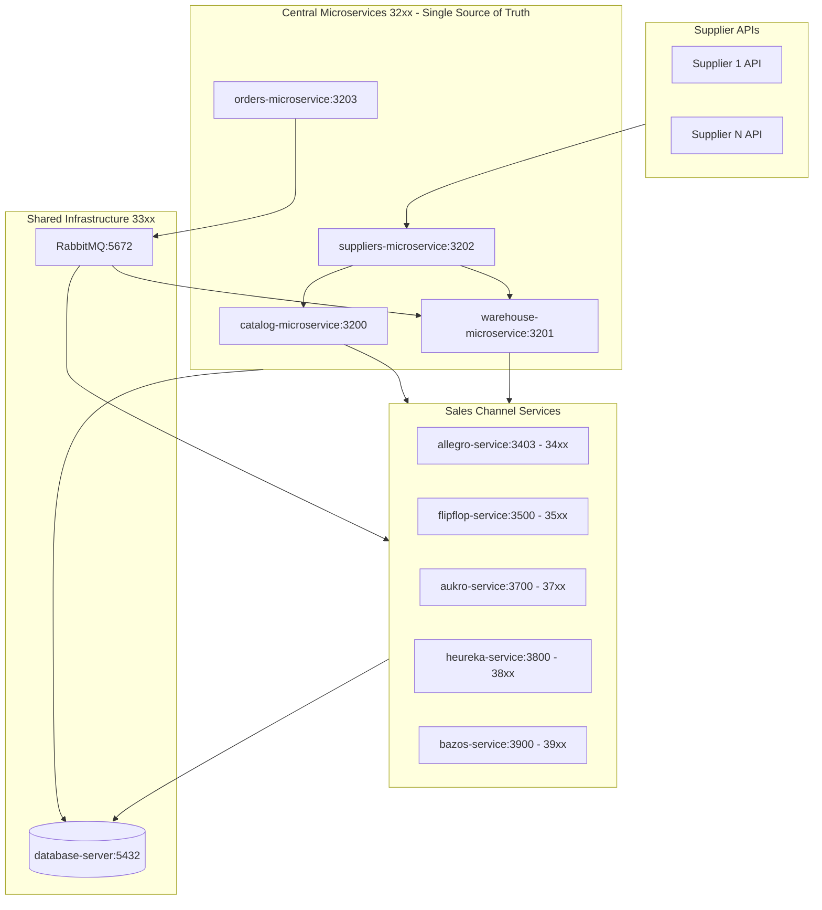

# Central E-commerce Microservices Implementation Plan

**Created**: 2024-12-20
**Status**: In Progress

## Overview

Building a unified e-commerce platform with central microservices as single source of truth for all products and stock, with real-time sync to all sales channels via RabbitMQ events.

## Architecture Overview



## Git Repositories

**Central Microservices:**

- `git@github.com:speakASAP/catalog-microservice.git`
- `git@github.com:speakASAP/warehouse-microservice.git`
- `git@github.com:speakASAP/suppliers-microservice.git`
- `git@github.com:speakASAP/orders-microservice.git`

**Sales Channel Services:**

- `git@github.com:speakASAP/allegro-service.git` (renamed from allegro)
- `git@github.com:speakASAP/flipflop-service.git` (renamed from flipflop)
- `git@github.com:speakASAP/aukro-service.git`
- `git@github.com:speakASAP/heureka-service.git`
- `git@github.com:speakASAP/bazos-service.git`

## Port Range Allocation

| Range | Purpose | Services |
| ----- | ------- | -------- |
| **31xx** | crypto-ai-agent | 3100-3104 |
| **32xx** | Central e-commerce microservices | catalog, warehouse, supplier, order |
| **33xx** | Shared infrastructure microservices | auth, notifications, payment, logging, ai |
| **34xx** | allegro-service | Allegro.cz/pl platform |
| **35xx** | flipflop-service | FlipFlop.cz website |
| **36xx** | statex platform | Platform services |
| **37xx** | aukro-service | Aukro platform |
| **38xx** | heureka-service | Heureka platform |
| **39xx** | bazos-service | Bazos platform |

## Service Port Assignment

### Central Microservices (32xx)

| Service | Subdomain | Port |
| ------- | --------- | ---- |
| catalog-microservice | catalog.alfares.cz | 3200 |
| warehouse-microservice | warehouse.alfares.cz | 3201 |
| suppliers-microservice | supplier.alfares.cz | 3202 |
| orders-microservice | orders.alfares.cz | 3203 |

### Sales Channel Services

| Service | Subdomain | Port | Range |
| ------- | --------- | ---- | ----- |
| allegro-service | allegro.alfares.cz | 3403 | 34xx |
| flipflop-service | flipflop.alfares.cz | 3500 | 35xx |
| aukro-service | aukro.alfares.cz | 3700 | 37xx |
| heureka-service | heureka.alfares.cz | 3800 | 38xx |
| bazos-service | bazos.alfares.cz | 3900 | 39xx |

## Deployment

All services deploy using `nginx-microservice/scripts/blue-green/deploy-smart.sh` which:

- Auto-creates service registry if not exists
- Auto-configures nginx for subdomains
- Handles blue/green deployment with health checks

---

## Implementation Phases

### Phase 1: Rename Existing Services

#### 1.1 Rename allegro -> allegro-service

**Scope**: alfares server

**Changes Required**:

- [ ] Directory: `allegro/` -> `allegro-service/`
- [ ] Git remote: Update to `git@github.com:speakASAP/allegro-service.git`
- [ ] `.env` file: Update all service names, container names, paths
- [ ] `docker-compose*.yml`: Update service names, container names, image names
- [ ] Deployment scripts: Update paths and service references
- [ ] nginx-microservice registry: Update service name
- [ ] Code: Update any hardcoded references to "allegro"

#### 1.2 Rename flipflop -> flipflop-service

**Scope**: alfares server

**Changes Required**:

- [ ] Directory: `flipflop/` -> `flipflop-service/`
- [ ] Git remote: Update to `git@github.com:speakASAP/flipflop-service.git`
- [ ] `.env` file: Update all service names, container names, paths
- [ ] `docker-compose*.yml`: Update service names, container names, image names
- [ ] Deployment scripts: Update paths and service references
- [ ] nginx-microservice registry: Update service name
- [ ] Code: Update any hardcoded references to "flipflop"

### Phase 2: Create Central Microservices

#### 2.1 catalog-microservice (catalog.alfares.cz:3200)

**Purpose**: Single source of truth for all product data

**Location**: `~/Documents/Github/catalog-microservice`

**Key Tables**:

- `products` - SKU, title, description, brand, EAN, dimensions
- `categories` - Hierarchical category tree with materialized path
- `product_categories` - Many-to-many product-category links
- `attributes` - Attribute definitions
- `product_attributes` - Product attribute values
- `media` - Images, videos per product
- `product_pricing` - Base price, cost price, margin

**API Endpoints**:

- `GET/POST /products` - List/create products
- `GET/PUT /products/:id` - Get/update product
- `GET /categories` - Category tree
- `GET /attributes` - Attribute definitions

#### 2.2 warehouse-microservice (warehouse.alfares.cz:3201)

**Purpose**: Track stock across all warehouses

**Location**: `~/Documents/Github/warehouse-microservice`

**Key Tables**:

- `warehouses` - Own warehouses, supplier dropship locations
- `stock` - Product + warehouse + quantity + reserved
- `stock_movements` - In/out/transfer history
- `stock_reservations` - Reserved for pending orders

**API Endpoints**:

- `GET /stock/:productId` - Stock across all warehouses
- `GET /stock/total/:productId` - Total available stock
- `POST /stock/reserve` - Reserve stock for order
- `POST /stock/decrement` - Decrement after sale
- `POST /stock/increment` - Add stock (delivery, return)
- `GET /warehouses` - List warehouses

**RabbitMQ Events**:

- `stock.updated` - When stock changes
- `stock.low` - Below threshold
- `stock.out` - Out of stock

#### 2.3 Configure RabbitMQ

Configure exchanges, queues, bindings for stock events routing in `statex-infrastructure`.

### Phase 3: Refactor allegro-service to Use Central Microservices

**Current State**: allegro-service has local Product table, manages offers internally

**Target State**: allegro-service uses catalog-microservice and warehouse-microservice as data source

**Changes Required**:

- [x] Remove local Product model/table (removed from schema) ✅
- [x] Add API client for catalog-microservice (products, categories, attributes) ✅
- [x] Add API client for warehouse-microservice (stock levels) ✅
- [x] Add RabbitMQ subscriber for `stock.updated` events ✅
- [x] Update offer sync: pull products from catalog, push offers to Allegro.pl/cz (ImportService updated) ✅
- [x] Update OffersService.getOffer() to fetch product from catalog-microservice ✅
- [x] Update order flow: forward orders to orders-microservice ✅
- [x] Keep AllegroOffer, AllegroAccount tables for platform-specific data ✅

**Import Flow (Allegro -> Central)**:

```
Allegro API -> allegro-service -> catalog-microservice (create/update products)
                               -> warehouse-microservice (update stock)
```

**Export Flow (Central -> Allegro)**:

```
catalog-microservice -> allegro-service -> Allegro API (create/update offers)
warehouse-microservice -> allegro-service -> Allegro API (update stock)
```

### Phase 4: Refactor flipflop-service to Use Central Microservices

**Current State**: flipflop-service uses allegro database for products

**Target State**: flipflop-service uses catalog-microservice and warehouse-microservice

**Changes Required**:

- [x] Remove dependency on allegro database (ProductsService updated, AllegroIntegrationService refactored) ✅
- [x] Add API client for catalog-microservice (products, categories, attributes, media) ✅
- [x] Add API client for warehouse-microservice (stock levels, availability) ✅
- [x] Add RabbitMQ subscriber for `stock.updated` events (real-time stock display) ✅
- [x] Update product display: fetch from catalog-microservice ✅
- [x] Update AllegroIntegrationService to use catalog-microservice (removed direct DB connection) ✅
- [x] Update order flow: forward orders to orders-microservice ✅
- [ ] Update checkout: check stock via warehouse-microservice (cart-service needs update)

### Phase 5: Create Remaining Central Microservices

#### 5.1 suppliers-microservice (supplier.alfares.cz:3202)

**Purpose**: Connect to supplier APIs, import products and stock

**Key Tables**:

- `suppliers` - Name, API credentials, sync schedule
- `supplier_products` - Supplier SKU, cost price, availability
- `category_mappings` - Supplier category to catalog category
- `import_jobs` - Import history with counts and errors

#### 5.2 orders-microservice (orders.alfares.cz:3203)

**Purpose**: Central order processing from all channels

**Key Tables**:

- `orders` - Channel, customer info, addresses, totals
- `order_items` - Product, quantity, price, fulfillment status
- `order_status_history` - Status tracking
- `shipments` - Carrier, tracking, delivery status

### Phase 6: Multi-platform Expansion (Future)

- `aukro-service` (aukro.alfares.cz:3700)
- `heureka-service` (heureka.alfares.cz:3800)
- `bazos-service` (bazos.alfares.cz:3900)

---

## Directory Structure (After Implementation)

```
~/Documents/Github/
  # Central Microservices (32xx - Single Source of Truth)
  catalog-microservice/     # catalog.alfares.cz:3200
  warehouse-microservice/   # warehouse.alfares.cz:3201
  suppliers-microservice/    # supplier.alfares.cz:3202
  orders-microservice/       # orders.alfares.cz:3203

  # Sales Channel Services
  allegro-service/          # allegro.alfares.cz:3403 (34xx)
  flipflop-service/         # flipflop.alfares.cz:3500 (35xx)
  aukro-service/            # aukro.alfares.cz:3700 (37xx) - FUTURE
  heureka-service/          # heureka.alfares.cz:3800 (38xx) - FUTURE
  bazos-service/            # bazos.alfares.cz:3900 (39xx) - FUTURE

  # Shared Infrastructure (existing)
  database-server/
  statex-infrastructure/    # RabbitMQ
  logging-microservice/
  notifications-microservice/
  auth-microservice/
  payments-microservice/
  ai-microservice/
  nginx-microservice/
```

---

## Implementation Checklist

- [x] 1. Rename allegro -> allegro-service (all configs, docker, scripts, code, dev + prod) ✅
- [x] 2. Rename flipflop -> flipflop-service (all configs, docker, scripts, code, dev + prod) ✅
- [x] 3. Create catalog-microservice (3200) ✅
- [x] 4. Create warehouse-microservice (3201) ✅
- [x] 5. Configure RabbitMQ in statex-infrastructure ✅
- [x] 6. Refactor allegro-service to use Central Microservices (API clients, RabbitMQ subscriber, ImportService, InventoryService, OffersService, OrdersService) ✅
- [x] 7. Refactor flipflop-service to use Central Microservices (ProductsService, OrdersService, AllegroIntegrationService updated) ✅
- [x] 8. Create suppliers-microservice (3202) ✅
- [x] 9. Create orders-microservice (3203) ✅
- [x] 10. Update allegro-service OffersService to fetch products from catalog-microservice ✅
- [x] 11. Update allegro-service OrdersService to forward orders to orders-microservice ✅
- [x] 12. Update flipflop-service OrdersService to forward orders to orders-microservice ✅
- [x] 13. Refactor flipflop-service AllegroIntegrationService to use catalog-microservice (removed direct DB) ✅

---

## Document History

| Date | Version | Author | Changes |
| ---- | ------- | ------ | ------- |
| 2024-12-20 | 1.0 | Architecture Team | Initial plan |
| 2024-12-20 | 1.1 | Architecture Team | Completed: renamed services, created all 4 central microservices, configured RabbitMQ |
| 2024-12-20 | 1.2 | Architecture Team | Completed: refactored allegro-service and flipflop-service with API clients and RabbitMQ subscribers |
| 2024-12-20 | 1.3 | Architecture Team | Completed: Updated ImportService, InventoryService, ProductsService, StockEventsSubscriber to use central microservices |
| 2024-12-20 | 1.4 | Architecture Team | Completed: Updated OffersService, OrdersService (both services), AllegroIntegrationService to fully use central microservices |
